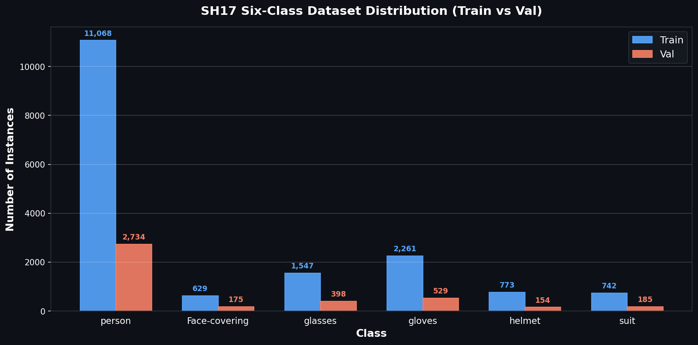

# SH17 six-class PPE detection

This folder trains **YOLOv9e** on a filtered six-class subset of SH17. The old
four-class Hardhat / Safety Vest dataset is not used.

Target classes, in order:

| ID | Class | Source SH17 names (matched by name, not by assumed ID) |
|---|---|---|
| 0 | `person` | `person` |
| 1 | `Face-covering` | `face-guard`, `face-mask` (alias: `face-mask-medical`) |
| 2 | `glasses` | `glasses` |
| 3 | `gloves` | `gloves` |
| 4 | `helmet` | `helmet` |
| 5 | `suit` | `medical-suit`, `safety-suit`, `safety-vest` |

`training/prepare_dataset.py` inspects the extracted dataset metadata and maps
whatever source IDs it finds. It does not assume SH17 folder layout or class
IDs until those files exist on disk.

## 1. Prerequisites

- Python 3.10 or newer
- NVIDIA GPU recommended for YOLOv9e (this machine class: RTX 4070 12 GB)
- Extracted SH17 dataset from a source you are licensed to use

Do not commit images, labels, or `.pt` weights.

## 2. Environment setup

From the repository root:

```powershell
python -m venv .venv
.\.venv\Scripts\Activate.ps1
python -m pip install --upgrade pip
```

## 3. NVIDIA GPU and PyTorch / CUDA

Install a **CUDA** build of PyTorch from [pytorch.org](https://pytorch.org/get-started/locally/)
**before** installing this project if you have an NVIDIA GPU. Example (check the
site for the current CUDA index; do not use this blindly if it is stale):

```powershell
python -m pip install torch torchvision --index-url https://download.pytorch.org/whl/cu128
python -m pip install -e ".[dev]"
```

If you install `ultralytics` first on Windows, pip may pull `torch` CPU wheels.
This repository does not pin a CPU-only PyTorch version.

Confirm:

```powershell
python -c "import torch; print(torch.__version__, torch.cuda.is_available())"
```

`torch.cuda.is_available()` must be `True` for practical YOLOv9e training.

## 4. SH17 dataset acquisition

This project does **not** download SH17. Place an extracted copy somewhere local
and pass `--source`.

Documented dataset sources (verify license and access yourself):

- GitHub: https://github.com/ahmadmughees/SH17dataset
- Kaggle: https://www.kaggle.com/datasets/mugheesahmad/sh17-dataset-for-ppe-detection
- Paper: https://arxiv.org/abs/2407.04590

Suggested local path (gitignored): `data/sh17/`

## 5. License and usage restrictions

SH17 images were collected from Pexels according to the dataset authors. This
repository is public. Do not commit the images. Confirm that your use matches
the dataset license and any Kaggle / Zenodo access rules before training.

## 6. Required source structure

The preparation script looks for, and adapts to, common layouts such as:

- `images/` plus `labels/` (YOLO `.txt`)
- a YAML file with a `names:` map (`sh17.yaml`, `data.yaml`, or similar)
- `classes.txt`
- `voc_labels/` XML files, used only if YOLO class names cannot be read otherwise
- optional `train_files.txt` / `val_files.txt`

If metadata is missing, the script exits with an error instead of guessing IDs.

## 7. Filtering and class remapping

- Source names are normalized and mapped to the six target classes.
- `face-guard` and `face-mask` merge into `Face-covering`.
- `medical-suit`, `safety-suit`, and `safety-vest` merge into `suit`.
- All other classes are dropped.
- Coordinates are validated; malformed boxes are skipped and counted, not silently repaired.
- Images with no remaining target objects are dropped unless `--include-negatives`.
- The original dataset is never modified.

## 8. Train / validation split

Default: 80% train / 20% val, `seed=42`, shuffle after a stable sort.

```powershell
python training/prepare_dataset.py --source data/sh17 --output data/filtered_sh17
```

Optional: `--use-source-split` if `train_files.txt` and `val_files.txt` exist.
That is not claimed to be stratified unless those files already are.

The script reports class counts and classes missing from either split. It does
not duplicate images to force balance.

### Dataset summary

| Metric | Count |
|---|---|
| Source images with labels | 8,099 |
| Images excluded (no target objects) | 356 |
| **Images retained** | **7,743** |
| Train images | 6,200 |
| Val images | 1,543 |
| Skipped annotations (excluded classes) | 54,799 |

### Class distribution (instances)

| Class | Train | Val | Total |
|---|---|---|---|
| `person` | 11,068 | 2,734 | 13,802 |
| `Face-covering` | 629 | 175 | 804 |
| `glasses` | 1,547 | 398 | 1,945 |
| `gloves` | 2,261 | 529 | 2,790 |
| `helmet` | 773 | 154 | 927 |
| `suit` | 742 | 185 | 927 |
| **Total** | **17,020** | **4,175** | **21,195** |

All six target classes are present in both train and val splits.



## 9. Dataset preparation command

```powershell
python training/prepare_dataset.py --source <extracted-sh17> --output data/filtered_sh17 --train-ratio 0.8 --seed 42
```

Outputs:

```text
data/filtered_sh17/
  images/train
  images/val
  labels/train
  labels/val
  data.yaml
  preparation_stats.json
```

## 10. YOLOv9e checkpoint setup

Default model identifier: `yolov9e.pt` (Ultralytics YOLOv9e, currently listed in
Ultralytics 8.4 assets). Ultralytics downloads it when you start training. Do
not commit the file. To use a local copy:

```powershell
python training/train.py --model F:\weights\yolov9e.pt
```

The script refuses non-YOLOv9e model names.

## 11. Training command

```powershell
python training/train.py --data data/filtered_sh17/data.yaml --model yolov9e.pt --epochs 50 --imgsz 640 --batch 2 --workers 2 --seed 42 --device 0
```

On a 12 GB GPU, start with `--batch 2` or `--batch 4` at `imgsz=640`. Windows
defaults to `--workers 2`. YOLOv9e will not run on CPU unless you pass
`--allow-cpu`. MLflow tracking is required; training stops if MLflow cannot
be initialized.

Outputs (gitignored): `runs/detect/yolov9e_sh17/` including `weights/best.pt`
and `weights/last.pt`, plots, and logs.

A fixed seed and `deterministic=True` are passed to Ultralytics. Bit-identical
results are not guaranteed across GPUs, CUDA versions, or package versions.

## 12. Validation command

Validation always uses the **val** split created by `prepare_dataset.py`.

```powershell
python training/val.py --model runs/detect/yolov9e_sh17/weights/best.pt --data data/filtered_sh17/data.yaml --split val
```

Pass `--training-run-id <mlflow-run-id>` to tag the validation run.

## 13. MLflow

Default tracking URI: `file:./mlruns` (gitignored).

```powershell
$env:MLFLOW_TRACKING_URI = "file:./mlruns"
$env:MLFLOW_EXPERIMENT_NAME = "industrial-safety-yolov9e"
python -m mlflow ui --backend-store-uri file:./mlruns
```

Open http://127.0.0.1:5000

Training and validation log parameters, metrics, and small JSON artifacts. They
do not upload the dataset or `.pt` files by default. There is no flag to disable
MLflow. If tracking fails, fix the MLflow install or `MLFLOW_TRACKING_URI`
before starting training.

## 14. Output locations

| Item | Location |
|---|---|
| Extracted SH17 | `data/sh17/` (you create this) |
| Filtered dataset | `data/filtered_sh17/` |
| Training runs | `runs/detect/yolov9e_sh17/` |
| Best / last weights | `runs/detect/yolov9e_sh17/weights/` |
| MLflow | `mlruns/` |
| Video demo | `python scripts/video_test.py --model ... --video ...` |

## 15. Troubleshooting

| Problem | What to check |
|---|---|
| `Source dataset directory does not exist` | SH17 is not extracted yet; pass `--source` |
| Missing class names / YAML | Wait for a complete extract; do not invent IDs |
| Missing target class (e.g. person) | Inspect source metadata; person boxes are never fabricated |
| Output directory not empty | Remove `data/filtered_sh17` only if you intend to regenerate it |
| `torch.cuda.is_available() is False` | CPU PyTorch is installed; install a CUDA wheel |
| Refusing model name | Must be YOLOv9e (`yolov9e.pt`) |
| CUDA out of memory | Lower `--batch` |
| MLflow import error | `pip install -e .` from this project |
| Checkpoint class names mismatch | Validate only a model trained on the six-class YAML |

Unit tests use a synthetic dataset and do not require SH17 or a GPU:

```powershell
python -m unittest tests.unit.test_prepare_dataset tests.unit.test_train_val_config
```
